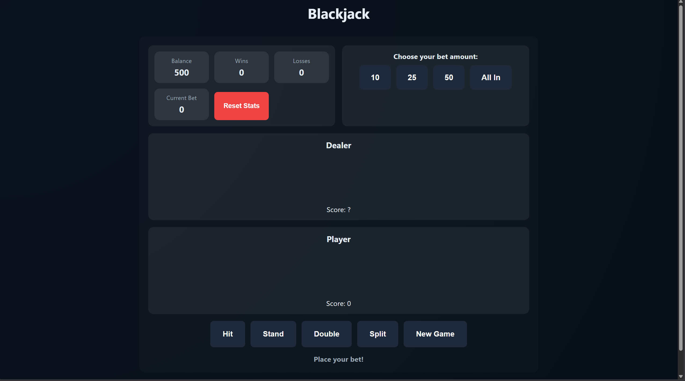
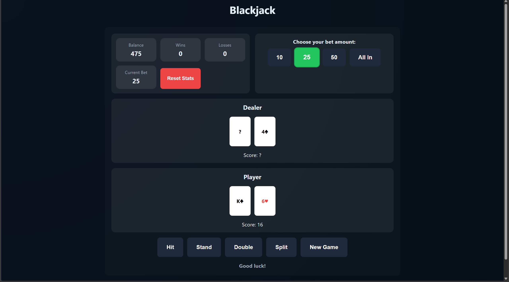
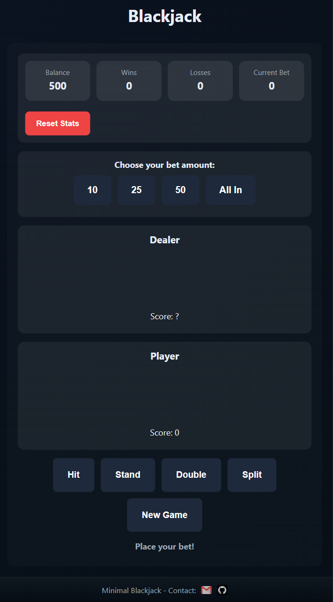

# Minimal Blackjack Game


A clean, accessible, and interactive Blackjack game built with HTML, CSS, and JavaScript. This project is fully responsive, animated, and accessible, providing a professional-grade web game experience.

---

## Table of Contents

- [Demo](#demo)
- [Features](#features)
- [Technologies Used](#technologies-used)
- [Gameplay](#gameplay)
- [Screenshots](#screenshots)
- [Installation](#installation)
- [Project Structure](#project-structure)
- [Accessibility](#accessibility)
- [Contributing](#contributing)
- [License](#license)
- [Contact](#contact)

---

## Demo

Try the live demo: [Live Demo](https://giorg1s.github.io/blackjack/)

---

## Features

- Fully functional Blackjack with standard actions:
  - Hit
  - Stand
  - Double Down
  - Split
- Betting system with adjustable chips and an All In option.
- Persistent statistics (balance, wins, losses) stored via `localStorage`.
- Responsive design for mobile, tablet, and desktop.
- Animated cards and UI transitions.
- Accessible UI: semantic HTML, ARIA labels, and keyboard navigation.
- One-click reset to clear statistics and start fresh.

---

## Technologies Used

- HTML5 (semantic markup)
- CSS3 (grid layout, animations, responsive)
- JavaScript (ES6 modules) for game logic, UI, and storage

---

## Gameplay

1. Place a bet using the chip controls or All In.
2. Use Hit, Stand, Double, or Split to play your hand.
3. Dealer draws automatically following standard Blackjack rules.
4. Balance and statistics update automatically based on the outcome.
5. Start a new round by placing a new bet.

---

## Screenshots

Below are a few gameplay screenshots — click any image to view the full-size version.



**Main Game** — The main gameplay screen showing the dealer's and player's hands, current bet, and action buttons (Hit, Stand, Double Down, Split).

---



**Betting Screen** — The betting UI with chip controls, preset bets, and an All In option for quick wagering.

---



**Mobile Responsive** — Compact, touch-friendly layout for mobile devices with readable cards and accessible controls.

---

## Installation

Clone the repository and run a local static server (required because the project uses ES6 modules):

```bash
git clone https://github.com/giorg1s/blackjack.git
cd blackjack
```

Open with a local server:

- Using VS Code Live Server: right-click `index.html` -> Open with Live Server
- Or via a simple static server in terminal:
```bash
npx serve
```

Then open the served URL in your browser (usually `http://localhost:5000` or as printed by the server).

---

## Project Structure

```
blackjack/
├── index.html          # Main entry point and UI structure
├── css/
│   └── style.css       # Custom styles and animations
├── js/
│   ├── deck.js         # Shuffling and dealing logic
│   ├── rules.js        # Game rules and scoring logic
│   ├── storage.js      # localStorage helpers and persistent stats
│   ├── ui.js           # DOM manipulation and event rendering
│   └── game.js         # Main game controller
├── images/             # Icons and screenshots
└── README.md           # Project documentation
```

---

## Accessibility

This project includes accessibility considerations:

- Semantic HTML5 (main, header, section) for meaningful structure.
- ARIA labels and roles where needed to support screen readers.
- Keyboard navigation and visible focus indicators for interactive elements.
- ARIA live regions for real-time game status updates.

Accessibility improvements and bug fixes are welcome — see the Contributing section.

---

## Contributing

Contributions are welcome! Suggested workflow:

1. Fork the repository.
2. Create a branch for your feature/fix:
```bash
git checkout -b feature/YourFeature
```
3. Make changes and commit with a descriptive message:
```bash
git commit -m "Add feature description"
```
4. Push your branch:
```bash
git push origin feature/YourFeature
```
5. Open a Pull Request describing your changes.

Please ensure accessibility, responsiveness, and code clarity when contributing.

---

## License

This project is licensed under the MIT License — see the [LICENSE](LICENSE.md) file for details.

---

## Contact

Giorgos Fyl  
Email: giorgosinbond@gmail.com  
GitHub: https://github.com/giorg1s

---